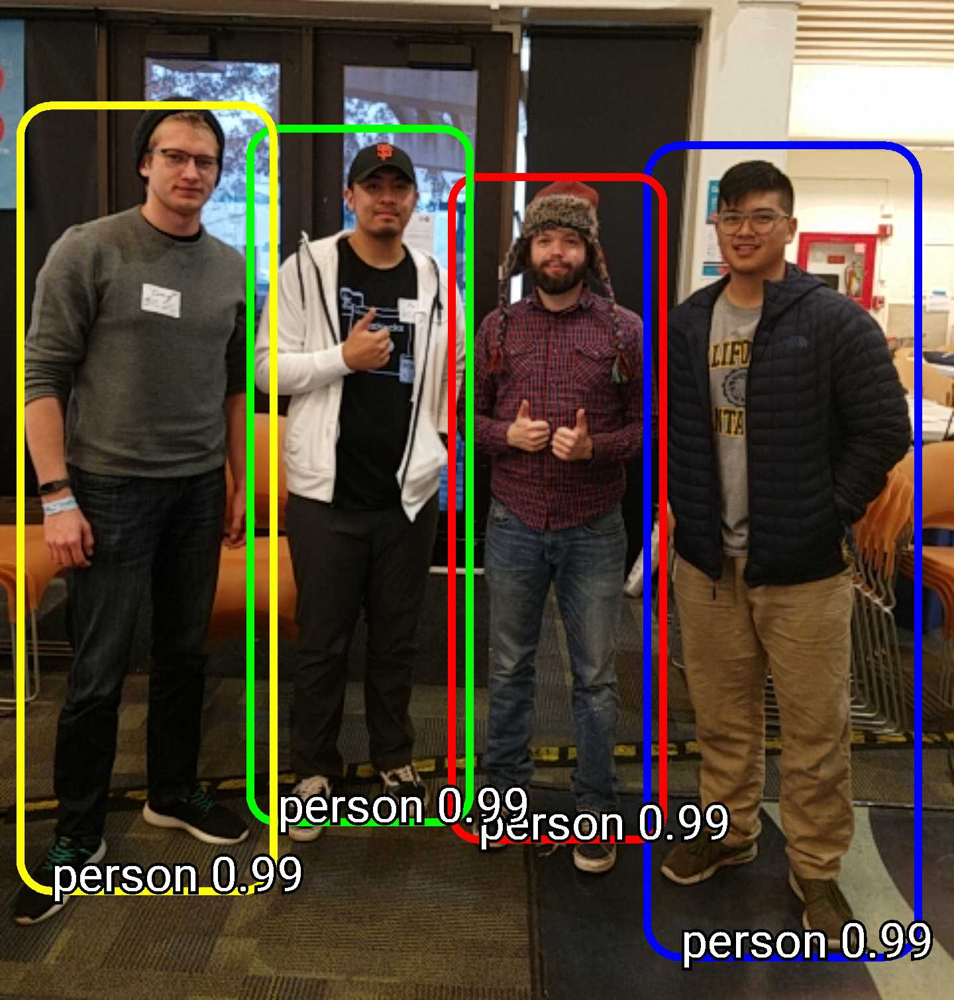

# EyeDog

A computer vision assistant for the visually impaired.

## Description

A virtual assistant that uses TensorFlow to recognize and warn the user about people or objects ahead. 
The warning will be in forms of voice and vibration.

# Requirement
A device running Android 7.1.1 (API 25).
